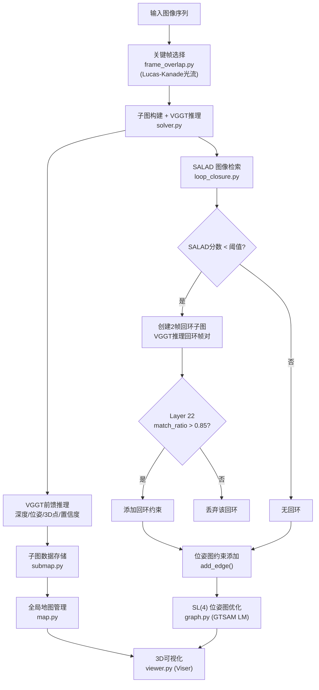
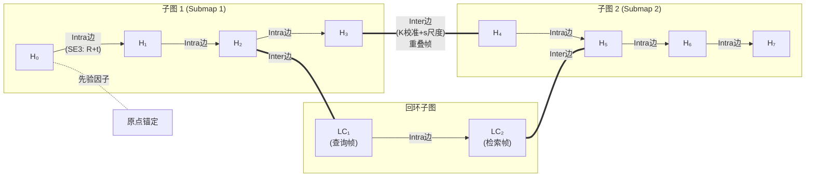
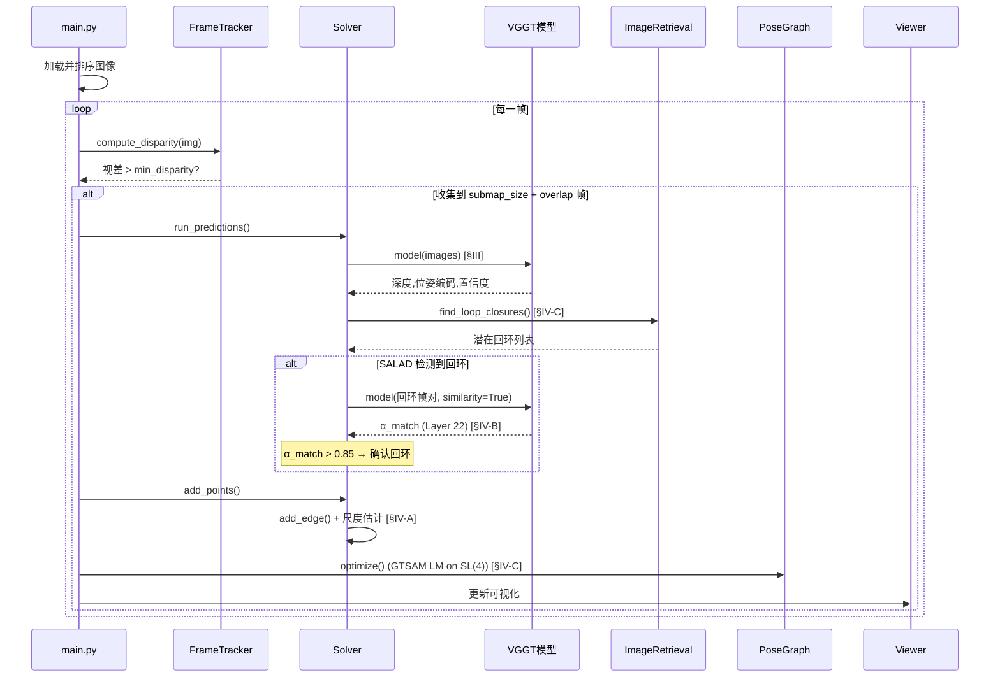
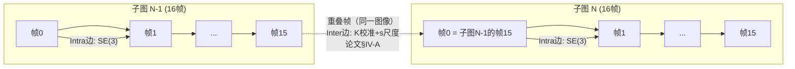
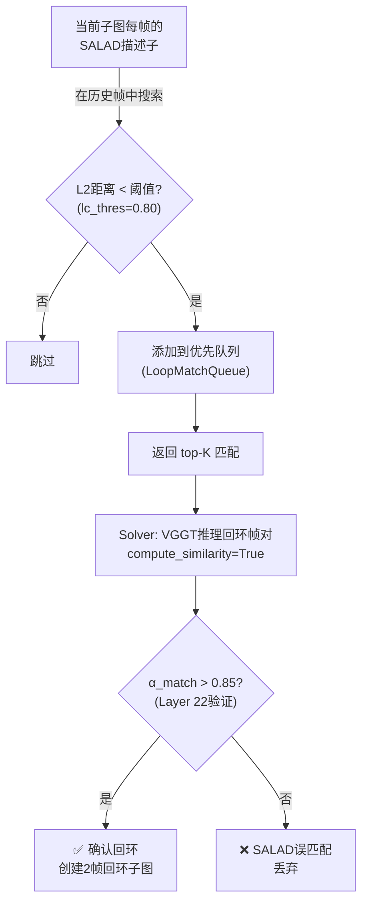

<style>
    body {
        background-color: white !important;
        color: black !important;
    }
</style>

# VGGT-SLAM 代码阅读指南

> 本文档结合论文 [VGGT-SLAM 2.0: Real-time Dense Feed-forward Scene Reconstruction](https://arxiv.org/abs/2601.19887) 带领你阅读整个代码库。

---

## 一、项目概览

**VGGT-SLAM 2.0** 是一个基于 **VGGT（Visual Geometry Grounded Transformer）** 前馈视觉模型的实时稠密 SLAM 系统。与传统 SLAM 使用迭代特征匹配和优化不同，它利用大规模预训练 Transformer 模型直接从 **未标定的单目 RGB 图像** 预测深度、位姿和3D点云，并在 **SL(4) 流形** 上进行后端位姿图优化。

### 核心特点

| 特性                   | 描述                                                                       | 论文章节    |
| ---------------------- | -------------------------------------------------------------------------- | ----------- |
| **前馈推理**           | 使用 VGGT-1B 模型直接预测多帧的深度、位姿、3D点和置信度                    | §III        |
| **SL(4) 优化**         | 在特殊线性群 SL(4) 上进行位姿图优化                                        | §III, §IV-C |
| **新因子图设计**       | 每个关键帧为一个节点，子图内 (intra) 和子图间 (inter) 使用不同类型的约束边 | §IV-A       |
| **VGGT Layer 22 验证** | 利用 VGGT 注意力层进行回环检索验证，无需额外训练                           | §IV-B       |
| **回环子图**           | 回环检测时创建独立的2帧子图，灵活处理回环约束                              | §IV-C       |
| **开放集搜索**         | 可选的 CLIP + SAM3 驱动的3D目标检测与定位                                  | §V-D        |
| **实时性**             | ~8.4 FPS（3090 GPU），~3.5 FPS（Jetson Thor）                              | §V-F        |

### 与 VGGT-SLAM 1.0 的主要改进（论文 §I）

| 问题       | VGGT-SLAM 1.0                    | VGGT-SLAM 2.0                                  |
| ---------- | -------------------------------- | ---------------------------------------------- |
| 高维漂移   | 15-DoF SL(4) 对齐导致快速漂移    | 分离 SE(3) 和仿射分量，仅在 inter 边上用 SL(4) |
| 平面退化   | 平面场景中求解15-DoF单应矩阵发散 | 强制重叠帧位置/旋转/标定一致，只求解尺度       |
| 因子图粒度 | 仅子图级别的节点                 | **关键帧级别的节点**（可修正帧级误差）         |
| 回环验证   | 仅依赖 SALAD 分数                | SALAD + **VGGT Layer 22 注意力验证**           |
| 回环处理   | 将检索帧加入当前子图             | 创建独立的**2帧回环子图**                      |

---

## 二、系统架构



---

## 三、文件结构与模块关系

```
VGGT-SLAM/
├── main.py                      # 主入口：整个流水线
├── setup.py / setup.sh          # 包安装 / 依赖安装
├── requirements.txt             # Python依赖
├── vggt_slam/                   # 核心模块
│   ├── solver.py                # ★ 核心求解器（对应论文§IV整体）
│   ├── submap.py                # 子图数据结构
│   ├── map.py                   # 全局地图管理
│   ├── graph.py                 # SL(4) 位姿图（对应论文§IV-A, §IV-C）
│   ├── slam_utils.py            # 工具函数集合
│   ├── viewer.py                # Viser 3D 可视化
│   ├── loop_closure.py          # 回环检测（对应论文§IV-B, §IV-C）
│   ├── frame_overlap.py         # 关键帧选择
│   └── scale_solver.py          # 尺度估计（对应论文§IV-A 公式4）
├── evals/                       # 评估脚本
│   ├── eval_tum.sh              # TUM数据集评估
│   └── process_logs_tum.py      # 日志处理
└── third_party/                 # 第三方依赖
    ├── vggt/                    # VGGT-1B 模型
    ├── salad/                   # SALAD 图像检索
    ├── perception_models/       # Perception Encoder CLIP
    └── sam3/                    # SAM3 分割模型
```

### 模块依赖关系

```mermaid
graph LR
    main["main.py"] --> solver["solver.py"]
    solver --> submap["submap.py"]
    solver --> map["map.py"]
    solver --> graph["graph.py"]
    solver --> viewer["viewer.py"]
    solver --> loop["loop_closure.py"]
    solver --> frame["frame_overlap.py"]
    solver --> scale["scale_solver.py"]
    solver --> utils["slam_utils.py"]
    submap --> utils
    map --> utils
    graph --> utils
    solver -.->|"第三方"| VGGT["VGGT模型"]
    loop -.->|"第三方"| SALAD["SALAD"]
    main -.->|"可选"| CLIP["CLIP + SAM3"]
```

---

## 四、论文核心理论与代码对照

### 4.1 SL(4) 流形与单应矩阵（论文 §III）

**论文定义**：两帧对应3D点 $X_i$ 和 $X_j$ 之间的关系用 4×4 单应矩阵表示：

$$
\tilde{X}_j = H_j^i \cdot \tilde{X}_i
$$

完整的 4×4 单应矩阵有 **15 个自由度**：

| 分量       | 自由度 | 说明             |
| ---------- | ------ | ---------------- |
| 平移 **t** | 3      | 三维平移向量     |
| 旋转 **R** | 3      | SO(3) 旋转矩阵   |
| 尺度 **s** | 1      | 全局缩放因子     |
| 仿射 **K** | 5      | 相机标定（内参） |
| 射影 **v** | 3      | 射影分量         |

SL(4) = { H ∈ ℝ⁴ˣ⁴ | det(H) = 1 }，是所有行列式为1的4×4矩阵构成的群。SE(3) 和 Sim(3) 都是 SL(4) 的子群。

**代码中的体现** → [graph.py](file:///c:/Users/Kwan_/Desktop/VGGT-SLAM/vggt_slam/graph.py)：
```python
# SL(4) 节点和因子
from gtsam import SL4, PriorFactorSL4, BetweenFactorSL4
# 噪声向量维度 = 15（SL(4) 的自由度）
inner_noise = 0.05 * np.ones(15, dtype=float)
```

### 4.2 因子图设计（论文 §IV-A, Fig. 3）

**论文 2.0 的关键改进**：将因子图从子图级别细化到 **关键帧级别**。



**两种边的区别**（论文核心贡献）：

| 边类型       | 代码变量             | 论文解释         | 变换内容                         |
| ------------ | -------------------- | ---------------- | -------------------------------- |
| **Intra 边** | `inner_submap_noise` | 子图内相邻帧约束 | 仅旋转 R 和平移 t（SE(3)子空间） |
| **Inter 边** | `intra_submap_noise` | 子图间重叠帧约束 | 仅标定 K 和尺度 s                |

> [!IMPORTANT]
> 论文的关键洞察：子图内部的射影畸变是一致的（因为由同一次 VGGT 推理产生），所以 Intra 边只需 SE(3)。而子图间的差异主要来自标定估计不一致与尺度模糊，所以 Inter 边处理仿射（K）和尺度（s）。

**代码中的体现** → [solver.py 的 add_edge()](file:///c:/Users/Kwan_/Desktop/VGGT-SLAM/vggt_slam/solver.py)：

```python
# Intra 边（子图内连续帧约束）
H_inner = world_to_cam[index-1] @ np.linalg.inv(pose)
self.graph.add_between_factor(..., H_inner, self.graph.inner_submap_noise)

# Inter 边（子图间重叠帧约束，包含尺度缩放）
H_scale = np.diag((scale_factor, scale_factor, scale_factor, 1.0))
H_overlap = inv(P_prior_last) @ P_current_first @ H_scale
self.graph.add_between_factor(..., H_overlap, self.graph.intra_submap_noise)
```

### 4.3 尺度估计（论文 §IV-A）

**论文公式**：重叠帧的3D点在各自相机坐标系下定义（不再相对于子图第一帧），因此对应点只差一个尺度因子。通过中值鲁棒估计：

$$
s = \text{median}\left(\frac{\|Y_i\|}{\|X_i\|}\right)
$$

**代码中的体现** → [scale_solver.py](file:///c:/Users/Kwan_/Desktop/VGGT-SLAM/vggt_slam/scale_solver.py)：
```python
def estimate_scale_pairwise(X, Y):
    x_dists = np.linalg.norm(X, axis=1)
    y_dists = np.linalg.norm(Y, axis=1)
    scales = y_dists / x_dists
    scale = np.median(scales)  # 中值估计
    return scale, None
```

### 4.4 VGGT Layer 22 回环验证（论文 §IV-B）

**论文核心发现**：VGGT 的 **第22层注意力层** 表现出"聚光灯"效应——当两张图像有重叠时，该层的注意力图会在对应位置产生大注意力值。

**匹配分数计算**（论文公式5-6）：
1. 计算图像2的 query tokens 对图像1的 key tokens 的注意力分数
2. 除以图像1内部的自注意力分数（归一化）
3. 取所有比率的 **top 25%** 的均值作为最终匹配分数 α_match

**代码中的体现** → [solver.py 的 run_predictions()](file:///c:/Users/Kwan_/Desktop/VGGT-SLAM/vggt_slam/solver.py)：
```python
# VGGT 推理回环帧对时启用 compute_similarity=True
predictions_lc = model(lc_frames, compute_similarity=True)

# 检查 image_match_ratio（即论文中的 α_match）
image_match_ratio = predictions_lc["image_match_ratio"]
if image_match_ratio < 0.85:
    # 匹配率太低，VGGT 认为两帧没有有效重叠，放弃此回环
    predictions_lc = None
```

> [!TIP]
> 这种方法的巧妙之处在于：它**免费**利用了 VGGT 内部已有的注意力层，不需要任何额外训练。而且它可以同时完成两件事：
> 1. **拒绝误匹配**：SALAD 在相似场景（如相同风格的办公隔间）中可能产生假阳性
> 2. **放宽检索阈值**：因为有二次验证，可以降低 SALAD 的初始阈值来获取更多回环候选

### 4.5 回环子图设计（论文 §IV-C, Fig. 3）

**论文方法**：与 VGGT-SLAM 1.0 不同，2.0 不把检索帧加入当前子图，而是创建一个独立的 **2帧回环子图**（查询帧 + 检索帧）。

**优势**：
- VGGT 可以先处理完当前批次的帧再进行检索
- 回环约束更灵活，不影响当前子图的推理

**代码中的体现** → [solver.py 的 add_points()](file:///c:/Users/Kwan_/Desktop/VGGT-SLAM/vggt_slam/solver.py)：
```python
# 创建回环子图（仅2帧）
lc_submap = Submap(lc_submap_num)
lc_submap.set_lc_status(True)  # 标记为回环子图

# 添加双向约束：
# 1. 查询帧 → 回环子图第一帧（正向Inter边）
self.add_edge(lc_submap_num, 0, loop.query_submap_id, loop.query_submap_frame, is_loop_closure=False)
# 2. 检索帧 ← 回环子图第二帧（反向Inter边，标记为回环）
self.add_edge(loop.detected_submap_id, loop.detected_submap_frame, lc_submap_num, 1, is_loop_closure=True)
```

### 4.6 全局重建恢复（论文 §IV-C, 公式7）

**论文公式**：给定优化后的单应矩阵 $H_i^w$，投影矩阵为 $P_i = K_i \cdot (H_i^w)^{-1}$

**代码中的体现** → [submap.py 的 get_all_poses_world()](file:///c:/Users/Kwan_/Desktop/VGGT-SLAM/vggt_slam/submap.py)：
```python
# 投影矩阵 = K @ inv(H_world)
projection_mat = self.proj_mats[index] @ np.linalg.inv(homography_world)
# 分解得到 K, R, t
cal, rot, trans, scale = decompose_camera(projection_mat[0:3,:])
```

---

## 五、核心数据流

### 5.1 整体流水线时序图



### 5.2 子图间连接与重叠帧



> 相邻子图通过 **重叠帧** 连接。重叠帧是前一子图的最后一帧 = 后一子图的第一帧。论文 2.0 的关键洞察：这两帧是**同一张图像**，因此它们的位置、旋转和标定必须相同，只需估计**尺度因子**。

---

## 六、逐文件详细解读

### 6.1 [main.py](file:///c:/Users/Kwan_/Desktop/VGGT-SLAM/main.py) — 主入口

**推荐优先阅读** ⭐ — 理解整体流水线

| 代码段     | 行号     | 功能                            | 对应论文   |
| ---------- | -------- | ------------------------------- | ---------- |
| 参数解析   | L32-50   | 子图大小、视差阈值、回环阈值等  | —          |
| 模型加载   | L72-97   | 加载 VGGT, 可选 CLIP + SAM3     | —          |
| 图像预处理 | L98-121  | 加载、排序、过滤、降采样        | —          |
| 主循环     | L122-170 | 关键帧选择→子图推理→优化→可视化 | §IV 全流程 |
| 语义搜索   | L190-234 | CLIP+SAM3 交互式3D目标检测      | §V-D       |
| 结果保存   | L236-250 | 位姿/点云文件导出               | —          |

---

### 6.2 [solver.py](file:///c:/Users/Kwan_/Desktop/VGGT-SLAM/vggt_slam/solver.py) — 核心求解器

**推荐第二个阅读** ⭐ — 对应论文 §IV 整体

| 方法                             | 功能                                        | 对应论文        |
| -------------------------------- | ------------------------------------------- | --------------- |
| `run_predictions()`              | VGGT推理 + SALAD检索 + Layer 22验证         | §IV-B, §IV-C    |
| `add_points()`                   | 反投影3D点 → 创建子图 → 添加约束 + 处理回环 | §IV-A, §IV-C    |
| `add_edge()`                     | ★ 尺度估计 + 因子图节点/边构建              | §IV-A (公式3-4) |
| `tranform_submap_to_canonical()` | 子图归一化到第一帧坐标系                    | §III            |

**`add_edge()` 核心逻辑**：
1. 通过重叠帧点云计算尺度因子 s（论文公式4）
2. 构建缩放矩阵 `diag(s, s, s, 1)` 
3. 计算 Inter 边的相对单应矩阵 `H_inter = K_j^{-1} · K_i · diag(s)`（论文公式3）
4. 通过链式传播计算新子图第一帧的世界位姿
5. 添加 Intra 边（子图内连续帧，论文公式3 简化为 SE(3)）

---

### 6.3 [graph.py](file:///c:/Users/Kwan_/Desktop/VGGT-SLAM/vggt_slam/graph.py) — SL(4) 位姿图

**推荐第三个阅读** ⭐ — 对应论文 §IV-A, §IV-C

> [!IMPORTANT]
> 这是理解 VGGT-SLAM 后端优化的关键文件。

**位姿图组成**：

| 组件     | GTSAM 类型         | 噪声 σ | 说明                          |
| -------- | ------------------ | ------ | ----------------------------- |
| 节点     | `SL4`              | —      | 每帧的 4×4 单应矩阵（15-DoF） |
| 先验因子 | `PriorFactorSL4`   | 1e-6   | 锚定第一帧于原点              |
| Intra 边 | `BetweenFactorSL4` | 0.05   | 子图内相邻帧约束              |
| Inter 边 | `BetweenFactorSL4` | 0.05   | 子图间重叠帧约束              |

`optimize()` 方法使用 GTSAM 的 **Levenberg-Marquardt** 优化器在 SL(4) 流形上求解。

---

### 6.4 [loop_closure.py](file:///c:/Users/Kwan_/Desktop/VGGT-SLAM/vggt_slam/loop_closure.py) — 回环检测

对应论文 §IV-B, §IV-C

**两阶段回环检测流程**：



**核心类结构**：
- `ImageRetrieval`: 封装 SALAD 模型，计算/比较全局描述子
- `LoopMatch`: 命名元组存储回环匹配信息
- `LoopMatchQueue`: 优先队列维护最佳 N 个回环

---

### 6.5 [submap.py](file:///c:/Users/Kwan_/Desktop/VGGT-SLAM/vggt_slam/submap.py) — 子图数据结构

**数据成员概览**：

| 属性                  | 形状         | 说明                       |
| --------------------- | ------------ | -------------------------- |
| `poses`               | (N, 4, 4)    | 世界到相机变换矩阵         |
| `frames`              | (N, 3, H, W) | 图像帧张量                 |
| `pointclouds`         | (N, H, W, 3) | 相机坐标系下的像素级3D点云 |
| `colors`              | (N, H, W, 3) | RGB颜色                    |
| `conf` / `conf_masks` | (N, H, W)    | 深度置信度                 |
| `proj_mats`           | (N, 4, 4)    | 4×4 内参矩阵（K 扩展）     |
| `retrieval_vectors`   | (N, D)       | SALAD 检索向量             |
| `semantic_vectors`    | (N, D)       | CLIP 语义向量（可选）      |
| `is_lc_submap`        | bool         | 是否为回环子图（2帧）      |

> [!NOTE]
> 论文2.0的关键设计：3D点定义在**各自相机坐标系**下（而非子图第一帧），这使得尺度估计可以独立于其他单应矩阵参数求解。

---

### 6.6 [map.py](file:///c:/Users/Kwan_/Desktop/VGGT-SLAM/vggt_slam/map.py) — 全局地图

管理所有子图（包括回环子图），提供：
- `retrieve_best_score_frame()`: SALAD L2距离检索（回环检测）
- `retrieve_best_semantic_frame()`: CLIP 余弦相似度检索（开放集搜索，论文§V-D）
- `write_poses_to_file()`: 导出 TUM/KITTI 格式位姿
- `save_framewise_pointclouds()`: 逐帧稠密点云导出

---

### 6.7 [frame_overlap.py](file:///c:/Users/Kwan_/Desktop/VGGT-SLAM/vggt_slam/frame_overlap.py) — 关键帧选择

基于 **Lucas-Kanade 金字塔光流** 的自适应关键帧选择：

1. Shi-Tomasi 角点检测（最多1000个角点）
2. LK 光流跟踪到当前帧
3. 计算平均特征点位移量
4. 位移 > `min_disparity`（默认50px）→ 选为新关键帧

---

### 6.8 [scale_solver.py](file:///c:/Users/Kwan_/Desktop/VGGT-SLAM/vggt_slam/scale_solver.py) — 尺度估计

对应论文 §IV-A 公式4。对重叠帧的对应3D点，使用**中值估计**尺度因子：

```
scale = median( ||Y_i|| / ||X_i|| )
```

中值而非均值提供了对离群点的鲁棒性。

---

### 6.9 [slam_utils.py](file:///c:/Users/Kwan_/Desktop/VGGT-SLAM/vggt_slam/slam_utils.py) — 工具函数

| 函数                         | 功能               | 用途                           |
| ---------------------------- | ------------------ | ------------------------------ |
| `sort_images_by_number()`    | 按文件名数字排序   | 确保时间顺序                   |
| `decompose_camera()`         | RQ分解 P → K, R, t | 从投影矩阵提取位姿 (论文公式7) |
| `compute_image_embeddings()` | CLIP 图像嵌入      | 开放集搜索                     |
| `normalize_to_sl4()`         | det归一化到SL(4)   | 确保 det(H)=1                  |
| `compute_obb_from_points()`  | PCA 有向包围盒     | 3D目标可视化                   |
| `Accumulator`                | 上下文计时器       | 性能分析                       |

---

### 6.10 [viewer.py](file:///c:/Users/Kwan_/Desktop/VGGT-SLAM/vggt_slam/viewer.py) — 3D 可视化

基于 **Viser** 的 Web 3D 查看器（http://localhost:8080）：
- 不同子图用不同随机颜色标识
- 每帧显示坐标轴 + 视锥体 + 图像缩略图
- "Play Walkthrough" 按钮自动遍历所有相机位姿
- `visualize_obb()` 绘制有向包围盒线框（开放集搜索结果）

---

## 七、性能与时间分析（论文 §V-F）

| 组件        | 每子图耗时 | 说明                 |
| ----------- | ---------- | -------------------- |
| VGGT推理    | ~1248 ms   | 占总时间一半以上     |
| SALAD检索   | ~ms级      | 轻量级全局描述子比较 |
| GTSAM优化   | ~ms级      | SL(4) LM 优化        |
| 总体 FPS    | ~8.4 FPS   | 3090 GPU, 无CLIP     |
| 含CLIP      | ~6.3 FPS   | 启用开放集搜索       |
| Jetson Thor | ~3.5 FPS   | 机器人嵌入式实时运行 |

---

## 八、推荐阅读顺序

| 步骤 | 文件                                   | 目的                                                     |
| ---- | -------------------------------------- | -------------------------------------------------------- |
| 1    | `main.py`                              | 理解整体流水线和参数配置                                 |
| 2    | `solver.py`                            | 理解核心逻辑，特别是 `add_edge()` 和 `run_predictions()` |
| 3    | `graph.py`                             | 理解 SL(4) 位姿图优化和因子图设计                        |
| 4    | `submap.py` + `map.py`                 | 理解数据结构和全局地图管理                               |
| 5    | `loop_closure.py`                      | 理解两阶段回环检测（SALAD + Layer 22）                   |
| 6    | `scale_solver.py` + `frame_overlap.py` | 理解尺度估计和关键帧选择                                 |
| 7    | `slam_utils.py` + `viewer.py`          | 辅助工具和可视化                                         |
| 8    | 论文 §IV 全文                          | 深入理解数学推导                                         |
